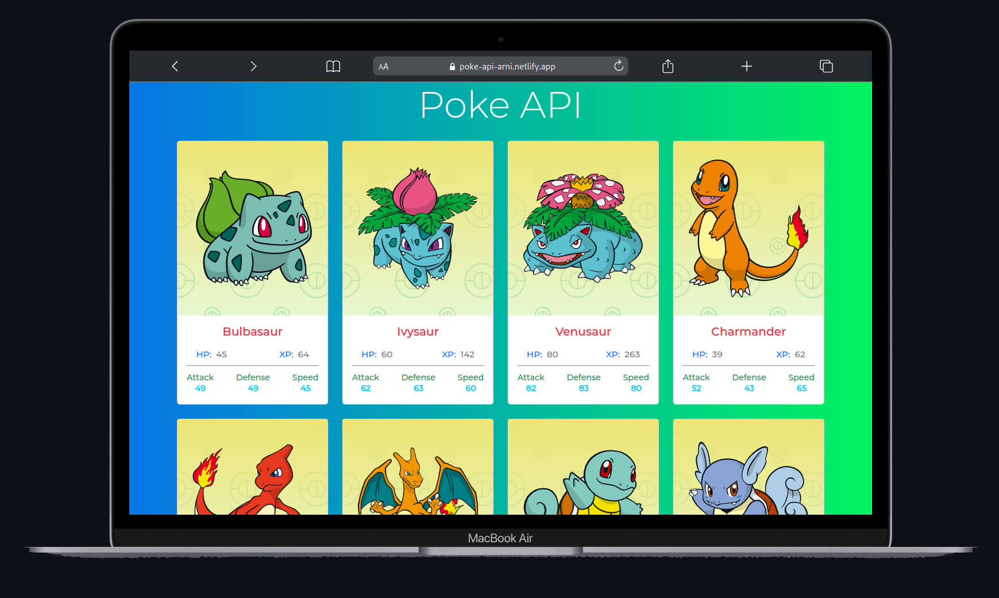

# PokeApi

### Pasos
1. Descargar el proyecto y abrirlo con el editor de su preferencia.
2. Abrir una terminal con la ruta del proyecto
3. Ejecutar el comando npm install
4. Ejecutar el comando ng serve -o
   

